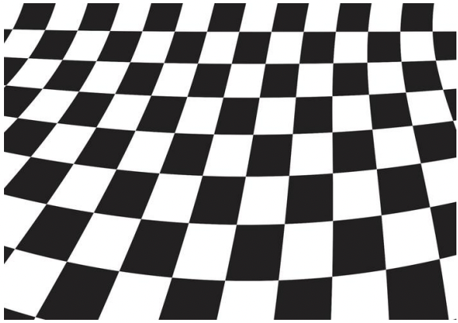
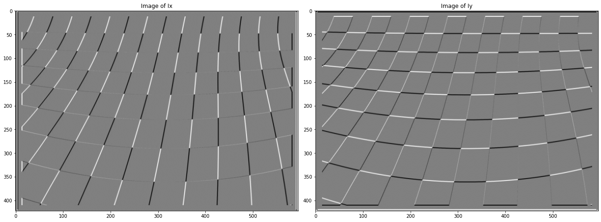
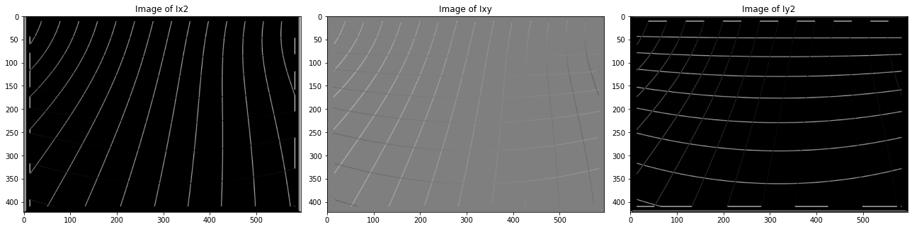
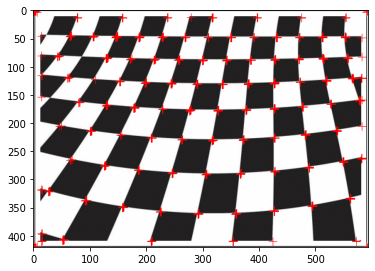

# IU CV Lab 3 - Harris detector

In this lab we implement corner detection using Harris detector. 
For a deep dive, please look at the [notebook here](playground.ipynb) and the [source code here](lab_3.py).
The report shows results of each step for better understanding.

We take an input image and convert it to grayscale

## 1. Input image

## 2. Derivatives in Horizontal and Vertical direction (Ix and Iy)

## 3. Ix^2, Ixy and Iy^2

## 4. Output

We calculate eigenvalues from those, use some threshold and find the output.

